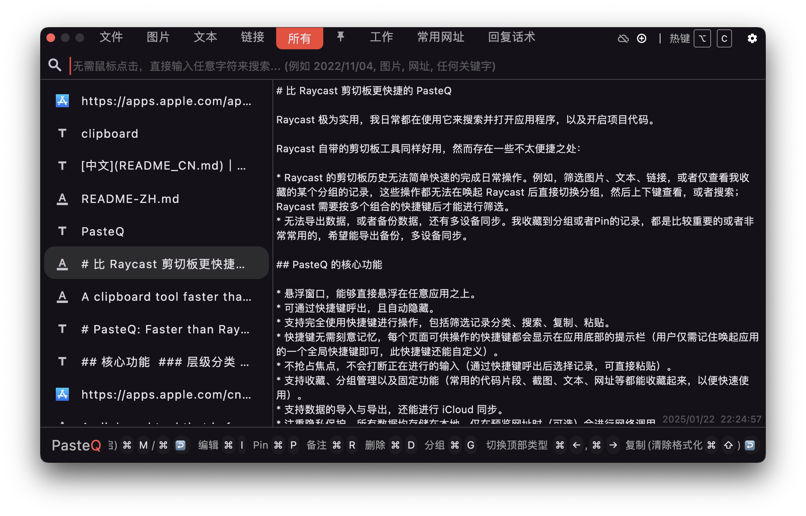
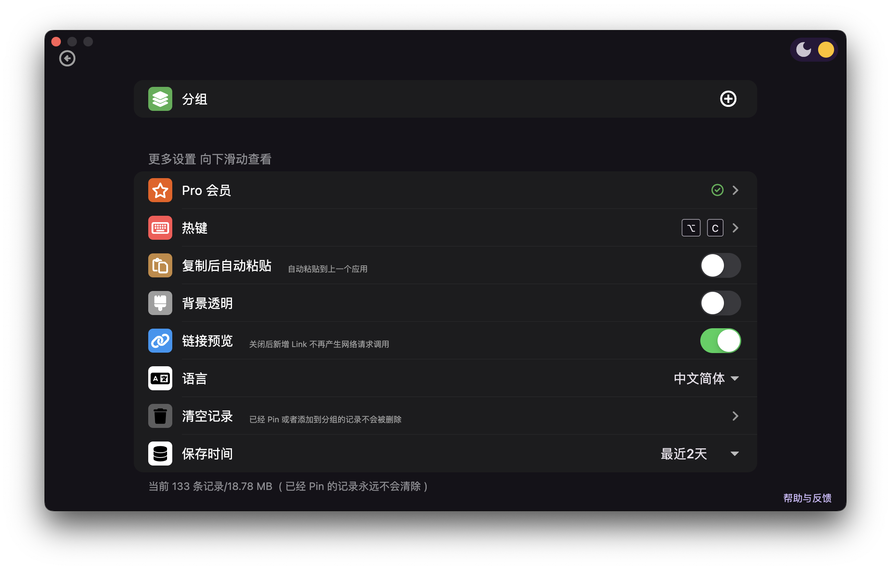

# [PasteQ](https://apps.apple.com/app/pasteq/id6443971843): 比 Raycast 剪切板更快捷的剪切板工具

中文｜[English](README.md)

Raycast 极为实用，我日常都在使用它来搜索并打开应用程序，以及开启项目代码。

Raycast 自带的剪切板工具同样好用，然而存在一些不太便捷之处：

* Raycast 的剪切板历史无法简单快速的完成日常操作。例如，筛选图片、文本、链接，或者仅查看我收藏的某个分组的记录，这些操作都无法在唤起 Raycast 后直接切换分组，然后上下键查看，或者搜索；Raycast 需要按多个组合的快捷键后才能进行筛选。
* 无法多选，合并多条记录。
* 无法导出数据，或者备份数据，还有多设备同步。我收藏到分组或者Pin的记录，都是比较重要的或者非常常用的，希望能导出备份，多设备同步。

## PasteQ 的核心功能

* 悬浮窗口，能够直接悬浮在任意应用之上。
* 可通过快捷键呼出，且自动隐藏。
* 支持完全使用快捷键进行操作，包括筛选记录分类、搜索、复制、粘贴。
* 快捷键无需刻意记忆，每个页面可供操作的快捷键都会显示在应用底部的提示栏（用户仅需记住唤起应用的一个全局快捷键即可，此快捷键还能自定义）。
* 不抢占焦点，不会打断正在进行的输入（通过快捷键呼出后选择记录，可直接粘贴）。
* 支持收藏、分组管理以及固定功能（常用的代码片段、截图、文本、网址等都能收藏起来，以便快速使用）。
* 支持多选记录，合并成一条复制。
* 记录再次编辑。
* 支持数据的导入与导出，还能进行 iCloud 同步。
* 注重隐私保护，所有数据均存储在本地，仅在预览网址时（可选）会进行网络调用。

## 下载

Mac App Store： [PasteQ](https://apps.apple.com/cn/app/pasteq/id6443971843)

> YouTobe 视频介绍： [https://youtu.be/zH7U3FAwX9c](https://youtu.be/zH7U3FAwX9c)
>
> B 站视频介绍： [https://www.bilibili.com/video/BV1RD4y1Y7mk](https://www.bilibili.com/video/BV1RD4y1Y7mk)

